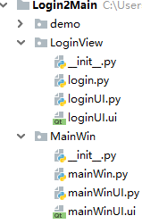
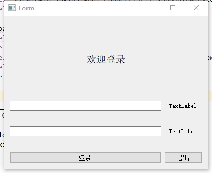
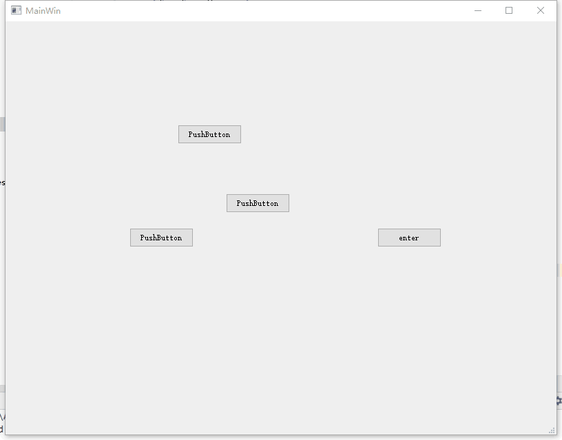

# <center> PyQt多窗口切换 </center>
1. 理解QApplication  
    每一个Qt程序都需要有一个QApplication对象，调用*.exec_()方法进入该程序的主循环（即事件循环），事件处理从调用该方法后开始，主循环接受事件消息并将其分发给程序的各个控件，并且程序中不能同时有多个事件循环。

2. show()方法  
    使用show()方法将窗口控件显示在屏幕上。

3. 实现多窗口(**非对话框形式**)  
    示例程序代码框架如下图所示：  
      
    loginView包中含有login界面的控件信息，以及login界面的控制器（即login界面中的业务逻辑），MainWin中包含的文件也是如此。  
    主程序main.py中主要负责显示窗口，以及绑定与切换窗口有关的信号/槽函数。
    ```python
    from PyQt5.QtWidgets import *
    from PyQt5.QtCore import *
    from PyQt5.QtGui import *
    import sys
    from LoginView.login import loginControl
    from MainWin.mainWin import MainWinController


    class ViewController:
        def loadLoginView(self):
            self.viewlogin = loginControl() #需要将viewlogin设为成员变量
            self.viewlogin.loginSignal.connect(self.loadMainWinView)
            self.viewlogin.show()

        def loadMainWinView(self, str):
            self.viewMainWIn = MainWinController()
            self.viewMainWIn.setWindowTitle("MainWin")
            self.viewMainWIn.exitSignal.connect(self.loadLoginView) #不需要回到登录界面可以省略
            self.viewMainWIn.show()


    if __name__ == '__main__':
        app = QApplication(sys.argv)
        view = ViewController()
        view.loadLoginView() #进入登录界面，如果viewlogin不是成员变量，则离开作用域后失效。
        sys.exit(app.exec_())
    ```
    目前来说主程序很简单，但是可以体现出基本的框架。  
    > `self.viewlogin = loginControl()`  
    
    创建一个loginControl()的成员变量，这里需要注意将其作为成员变量，否则在函数调用结束后，就会离开其作用域，该变量就会失效了，就可能会出现运行后一闪而过的现象。  
    > `self.viewlogin.loginSignal.connect(self.loadMainWinView)`  
    
    将登录界面中的登录成功信号绑定到加载主窗口的槽函数`loadMianWinView`函数中，用户点击登录按钮后（或者有别的方式执行登录操作时）我们往往还需要进行一些判断的操作等等，当一切准备就绪后，我们就可以在登录窗口发出loginSignal信号，当然也可以在信号中传递一些数据。
    > `self.viewlogin.show()`  

    接下来就是将这个界面显示出来。

    **两个窗口都在一个事件循环中**  

    下面是login.py的代码:  
    ```python
    from PyQt5.QtGui import *
    from PyQt5.QtWidgets import *
    from PyQt5.QtCore import *
    from LoginView.loginUI import *


    class loginControl(QWidget, Ui_Form):
        loginSignal = pyqtSignal(str)
        def __init__(self, parent= None):
            super(loginControl, self).__init__(parent)
            self.setupUi(self)
            self.pushButton_enter.clicked.connect(self.btnEnterClicked)
            self.pushButton_exit.clicked.connect(self.btnExitClicked)

        def btnEnterClicked(self):
            print("enter clicked")
            
            #中间可以添加处理逻辑

            self.loginSignal.emit("login")
            self.close()

        def btnExitClicked(self):
            print("Exit clicked")
            self.close()
    ```
    这只是demo有别的需要还可以往里面加东西。

    下面是mainWin.py的代码：  
    ```python
    from PyQt5.QtWidgets import *
    from PyQt5.QtCore import *
    from PyQt5.QtGui import *
    from MainWin.mainWinUI import *


    class MainWinController(QMainWindow, Ui_MainWindow):
        exitSignal = pyqtSignal()

        def __init__(self, parent=None):
            super(MainWinController, self).__init__(parent)
            self.setupUi(self)
            self.pushButton_enter.clicked.connect(self.btnEnterClicked)

        def btnEnterClicked(self):
            print("enter clicked")

        def closeEvent(self, a0: QtGui.QCloseEvent) -> None:
            print("closed")
            self.exitSignal.emit()
            self.close()
    ```
    这同样也只是一个demo。  

* 示例代码演示  
    运行程序后进入登录界面，如下图所示：  
      
    点击登录按钮后进入主界面，如下图所示：  
      
    关闭主界面后还可以回到登录界面。


### 源代码
```python
#main.py
from PyQt5.QtWidgets import *
from PyQt5.QtCore import *
from PyQt5.QtGui import *
import sys
from LoginView.login import loginControl
from MainWin.mainWin import MainWinController


class ViewController:
    def loadLoginView(self):
        self.viewlogin = loginControl()
        self.viewlogin.loginSignal.connect(self.loadMainWinView)
        self.viewlogin.show()

    def loadMainWinView(self, str):
        self.viewMainWIn = MainWinController()
        self.viewMainWIn.setWindowTitle("MainWin")
        self.viewMainWIn.exitSignal.connect(self.loadLoginView)
        self.viewMainWIn.show()
        print(str)


if __name__ == '__main__':
    app = QApplication(sys.argv)
    view = ViewController()
    view.loadLoginView()
    sys.exit(app.exec_())

#login.py
from PyQt5.QtGui import *
from PyQt5.QtWidgets import *
from PyQt5.QtCore import *
from LoginView.loginUI import *


class loginControl(QWidget, Ui_Form):
    loginSignal = pyqtSignal(str)
    def __init__(self, parent= None):
        super(loginControl, self).__init__(parent)
        self.setupUi(self)
        self.pushButton_enter.clicked.connect(self.btnEnterClicked)
        self.pushButton_exit.clicked.connect(self.btnExitClicked)

    def btnEnterClicked(self):
        print("enter clicked")
        self.loginSignal.emit("login")
        self.close()

    def btnExitClicked(self):
        print("Exit clicked")
        self.close()


#loginUI.py
# -*- coding: utf-8 -*-

# Form implementation generated from reading ui file 'loginUI.ui'
#
# Created by: PyQt5 UI code generator 5.12.1
#
# WARNING! All changes made in this file will be lost!

from PyQt5 import QtCore, QtGui, QtWidgets


class Ui_Form(object):
    def setupUi(self, Form):
        Form.setObjectName("Form")
        Form.resize(400, 300)
        self.verticalLayout = QtWidgets.QVBoxLayout(Form)
        self.verticalLayout.setObjectName("verticalLayout")
        self.label = QtWidgets.QLabel(Form)
        sizePolicy = QtWidgets.QSizePolicy(QtWidgets.QSizePolicy.Preferred, QtWidgets.QSizePolicy.Expanding)
        sizePolicy.setHorizontalStretch(0)
        sizePolicy.setVerticalStretch(0)
        sizePolicy.setHeightForWidth(self.label.sizePolicy().hasHeightForWidth())
        self.label.setSizePolicy(sizePolicy)
        font = QtGui.QFont()
        font.setFamily("宋体")
        font.setPointSize(14)
        self.label.setFont(font)
        self.label.setAlignment(QtCore.Qt.AlignCenter)
        self.label.setObjectName("label")
        self.verticalLayout.addWidget(self.label)
        self.gridLayout = QtWidgets.QGridLayout()
        self.gridLayout.setVerticalSpacing(30)
        self.gridLayout.setObjectName("gridLayout")
        self.pushButton_enter = QtWidgets.QPushButton(Form)
        self.pushButton_enter.setObjectName("pushButton_enter")
        self.gridLayout.addWidget(self.pushButton_enter, 2, 0, 1, 1)
        self.lineEdit_2 = QtWidgets.QLineEdit(Form)
        self.lineEdit_2.setObjectName("lineEdit_2")
        self.gridLayout.addWidget(self.lineEdit_2, 1, 0, 1, 1)
        self.lineEdit = QtWidgets.QLineEdit(Form)
        self.lineEdit.setObjectName("lineEdit")
        self.gridLayout.addWidget(self.lineEdit, 0, 0, 1, 1)
        self.pushButton_exit = QtWidgets.QPushButton(Form)
        self.pushButton_exit.setObjectName("pushButton_exit")
        self.gridLayout.addWidget(self.pushButton_exit, 2, 1, 1, 1)
        self.label_2 = QtWidgets.QLabel(Form)
        self.label_2.setAlignment(QtCore.Qt.AlignCenter)
        self.label_2.setObjectName("label_2")
        self.gridLayout.addWidget(self.label_2, 0, 1, 1, 1)
        self.label_3 = QtWidgets.QLabel(Form)
        self.label_3.setAlignment(QtCore.Qt.AlignCenter)
        self.label_3.setObjectName("label_3")
        self.gridLayout.addWidget(self.label_3, 1, 1, 1, 1)
        self.verticalLayout.addLayout(self.gridLayout)

        self.retranslateUi(Form)
        QtCore.QMetaObject.connectSlotsByName(Form)

    def retranslateUi(self, Form):
        _translate = QtCore.QCoreApplication.translate
        Form.setWindowTitle(_translate("Form", "Form"))
        self.label.setText(_translate("Form", "欢迎登录"))
        self.pushButton_enter.setText(_translate("Form", "登录"))
        self.pushButton_exit.setText(_translate("Form", "退出"))
        self.label_2.setText(_translate("Form", "TextLabel"))
        self.label_3.setText(_translate("Form", "TextLabel"))


#mainWin.py
from PyQt5.QtWidgets import *
from PyQt5.QtCore import *
from PyQt5.QtGui import *
from MainWin.mainWinUI import *


class MainWinController(QMainWindow, Ui_MainWindow):
    exitSignal = pyqtSignal()

    def __init__(self, parent=None):
        super(MainWinController, self).__init__(parent)
        print("enter")
        self.setupUi(self)
        self.pushButton_enter.clicked.connect(self.btnEnterClicked)
        self.exitSignal.connect(lambda: print("emit"))

    def btnEnterClicked(self):
        print("enter clicked")

    def closeEvent(self, a0: QtGui.QCloseEvent) -> None:
        print("closed")
        self.exitSignal.emit()
        self.close()


#mainWinUI.py
# -*- coding: utf-8 -*-

# Form implementation generated from reading ui file 'mainWinUI.ui'
#
# Created by: PyQt5 UI code generator 5.12.1
#
# WARNING! All changes made in this file will be lost!

from PyQt5 import QtCore, QtGui, QtWidgets


class Ui_MainWindow(object):
    def setupUi(self, MainWindow):
        MainWindow.setObjectName("MainWindow")
        MainWindow.resize(800, 600)
        self.centralwidget = QtWidgets.QWidget(MainWindow)
        self.centralwidget.setObjectName("centralwidget")
        self.pushButton = QtWidgets.QPushButton(self.centralwidget)
        self.pushButton.setGeometry(QtCore.QRect(250, 150, 93, 28))
        self.pushButton.setObjectName("pushButton")
        self.pushButton_2 = QtWidgets.QPushButton(self.centralwidget)
        self.pushButton_2.setGeometry(QtCore.QRect(320, 250, 93, 28))
        self.pushButton_2.setObjectName("pushButton_2")
        self.pushButton_3 = QtWidgets.QPushButton(self.centralwidget)
        self.pushButton_3.setGeometry(QtCore.QRect(180, 300, 93, 28))
        self.pushButton_3.setObjectName("pushButton_3")
        self.pushButton_enter = QtWidgets.QPushButton(self.centralwidget)
        self.pushButton_enter.setGeometry(QtCore.QRect(540, 300, 93, 28))
        self.pushButton_enter.setObjectName("pushButton_enter")
        MainWindow.setCentralWidget(self.centralwidget)
        self.menubar = QtWidgets.QMenuBar(MainWindow)
        self.menubar.setGeometry(QtCore.QRect(0, 0, 800, 26))
        self.menubar.setObjectName("menubar")
        MainWindow.setMenuBar(self.menubar)
        self.statusbar = QtWidgets.QStatusBar(MainWindow)
        self.statusbar.setObjectName("statusbar")
        MainWindow.setStatusBar(self.statusbar)

        self.retranslateUi(MainWindow)
        QtCore.QMetaObject.connectSlotsByName(MainWindow)

    def retranslateUi(self, MainWindow):
        _translate = QtCore.QCoreApplication.translate
        MainWindow.setWindowTitle(_translate("MainWindow", "MainWindow"))
        self.pushButton.setText(_translate("MainWindow", "PushButton"))
        self.pushButton_2.setText(_translate("MainWindow", "PushButton"))
        self.pushButton_3.setText(_translate("MainWindow", "PushButton"))
        self.pushButton_enter.setText(_translate("MainWindow", "enter"))
```